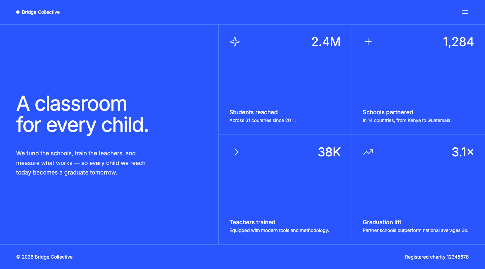

# Frontend Mentor - Grid landing page solution

This is a solution to the [Grid landing page challenge on Frontend Mentor](https://www.frontendmentor.io/challenges?search=grid%20landing%20page). Frontend Mentor challenges help you improve your coding skills by building realistic projects.

## Table of contents

- [Overview](#overview)
  - [The challenge](#the-challenge)
  - [Screenshot](#screenshot)
  - [Links](#links)
- [My process](#my-process)
  - [Built with](#built-with)
  - [Pixel-perfect workflow](#pixel-perfect-workflow)
  - [What I learned](#what-i-learned)
- [Getting started](#getting-started)
- [Deployment](#deployment)
- [Author](#author)

## Overview

### The challenge

Users should be able to:

- View the optimal layout for the page depending on their device's screen size
- See hover and focus states for all interactive elements on the page
- Open and close the navigation menu at any screen size

### Screenshot



### Links

- Solution URL: [github.com/1t1sCooL/grid-landing-page-main](https://github.com/1t1sCooL/grid-landing-page-main)
- Live Site URL: [mmalabugin.ru/GridLandingPage/](https://mmalabugin.ru/GridLandingPage/)

## My process

### Built with

- Semantic HTML5 markup
- CSS custom properties
- CSS Grid and Flexbox
- Mobile-first workflow
- [Next.js](https://nextjs.org/) (Pages Router) with `output: "export"` — the page ships as static HTML
- [next/font](https://nextjs.org/docs/pages/building-your-application/optimizing/fonts) — the Inter variable font from the challenge, self-hosted and preloaded
- `:has()` for card hover/focus states without extra JavaScript
- `inert` on the closed menu panel so it is skipped by keyboard and screen readers

### Pixel-perfect workflow

The designs ship as JPGs, so every value in `globals.css` was measured off them rather
than guessed: dividers, cap heights, baselines, ink widths and word positions were read
pixel by pixel and then compared against a headless-Chromium screenshot of the build at
1440×800 and 375×1816 until the two matched.

Two findings shaped the type styles:

- **Inter 4 has an `opsz` axis (14 → 32).** Chrome's default `font-optical-sizing: auto`
  swaps in the display cut above 14px, which rendered the headline and the stat numbers
  visibly tighter than the reference. Pinning the text cut with `font-optical-sizing: none`
  brought the glyph shapes back in line.
- **Tracking is per role.** With the text cut pinned, the headline needs `-0.032em`, the
  menu links `-0.045em`, and the stat descriptions `-0.02em` to reproduce the reference
  line lengths.

The remaining measured deltas against the reference JPGs are within ±1px on the desktop
layout and ±2px on mobile — the rest of the difference in a pixel diff is JPEG ringing
around the glyph edges.

### What I learned

The grid is one `display: grid` for the whole page body: the hero spans both rows of the
first column, and the stat cards fill the other two. The hairlines are `border-left` and
`border-top` on the cards rather than a `gap`, so the divider lands on the exact pixel
column the design uses and no line is drawn along the outer edges.

```css
.grid {
  grid-template-columns: 648fr 396fr 396fr;
  grid-template-rows: 1fr 1fr;
}

.stat {
  border-left: 1px solid var(--blue-400);
}

.stat:nth-of-type(3),
.stat:nth-of-type(4) {
  border-top: 1px solid var(--blue-400);
}
```

The cards are not links in the markup — the label is, and its `::after` is stretched over
the whole card. That keeps the heading structure intact while giving the card a real focus
state instead of a hover-only affordance.

## Getting started

```bash
npm install
npm run dev
```

Open [http://localhost:3000](http://localhost:3000) with your browser to see the result.
You can start editing the page by modifying `src/components/gridPage/GridBody.tsx`.

```bash
npm run build   # static export into ./out
npm run lint
```

`NEXT_PUBLIC_BASE_PATH` sets the sub-path the export is built for. It is empty locally and
`/GridLandingPage` in the Docker build.

## Deployment

The image is built by Jenkins from the `Dockerfile` (Node build → static files served by
nginx) and applied to Kubernetes with kustomize:

```bash
docker build -t 1t1scool/grid-landing-page-main .
kubectl apply -k kubernetes/
```

## Author

- Website - [mmalabugin.ru](https://mmalabugin.ru/)
- Frontend Mentor - [@1t1sCooL](https://www.frontendmentor.io/profile/1t1sCooL)
- Twitter - [@vi_el_mar](https://www.twitter.com/vi_el_mar)
- Telegram - [@ItIsCooL](https://t.me/ItIsCooL)
